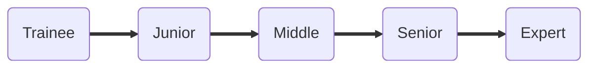

# skills-matrix
Skills matrix to evaluate AQA engineers

## How to use?

- Open in Github pages: https://infopulse.github.io/Tech-Skills-Matrix-AQA/
- Review required skills for each level and category
- Evaluate yourself and your team members

We encourage you to use this matrix in your companies to align the skills and knowledge of AQA engineers worldwide.

It is expected:

1. every AQA Engineer who claims a specific seniority level must have 4+ basic skills not less than this level
2. every next seniority level includes skills and knowledge of all previous levels
3. tech skills are generalized to apply to a wide range of engineers
4. as AQA = A + QA - it's expected that the skills of the specialist also correspond to their seniority by [QA matrix](https://infopulse.github.io/Tech-Skills-Matrix-QA/)

## How to contribute?

You are welcome to leave your comments and suggestions in [Issues](https://github.com/infopulse/Tech-Skills-Matrix-AQA/issues) 
Or create a pull request!
